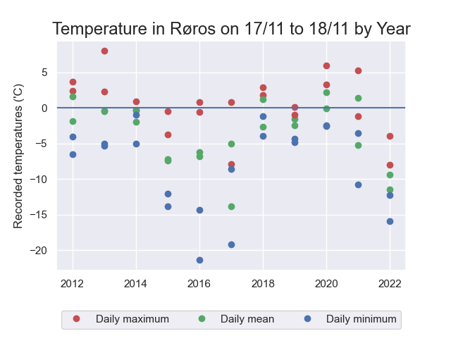
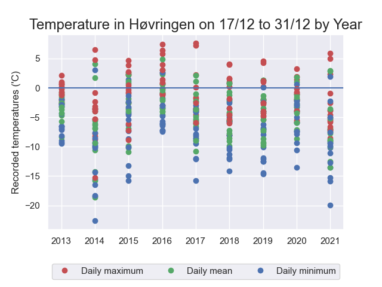

# yr_context - Norwegian temperature graphing

A quick script to get historic weather data from the Norwegian meteorological
institute on a given date for the last decade, and present it as a graph.

Can graph data from any weather station in Norway.  See `yr_context -h` for all options.

Example output:

`$ python yr_context.py --location røros --day 18 --month 11 --num_days 2`

`$ python yr_context.py --location høvringen --day 31 --month 12 --num_days 15`

Uses data from https://frost.met.no/

Requires a free client-id from frost.met.no to function.
Request this at https://frost.met.no/auth/requestCredentials.html

Place the client-id in a file called client_id.txt in this directory.
